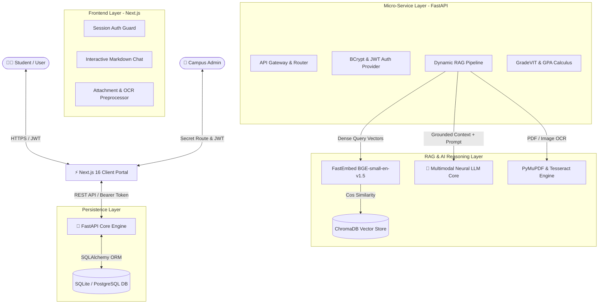

# 🎓 CampusLLM — Enterprise University RAG & Multimodal AI Platform

[](https://nextjs.org/)
[](https://fastapi.tiangolo.com/)
[](https://fastapi.tiangolo.com/)
[](https://www.trychroma.com/)
[](LICENSE)

**CampusLLM** is an enterprise-grade, retrieval-augmented generation (RAG) campus intelligence platform engineered to resolve academic, procedural, placement, and technical inquiries for university students. Engineered with state-of-the-art multimodal reasoning, **ChromaDB** vector storage, **FastEmbed ONNX** dense embeddings, and an in-chat **GradeVIT** academic simulator.

---

## 🏛️ System Architecture



---

## ✨ Key Platform Capabilities

### 1. 📄 Multimodal Document & Syllabus Reasoner
- **Zero-Friction Ingestion**: Students can attach lecture notes, lab assignments, course syllabi (`.pdf`), and code files directly in the chat interface.
- **Universal Syllabus Deconstruction**: Automatically parses complex PDFs (e.g., `CYBER-SECURITY.pdf`, `DEEP-LEARNING.pdf`) to extract module titles, lecture hours, and unit subtopics.
- **High-Impact CAT Preparation**: Dynamically synthesizes customizable 5-hour study roadmaps, exam priority checklists, and probable 5-mark theoretical and numerical derivations.

### 2. 🧠 Grounded Campus RAG Knowledge Engine
- **Noise-Filtered Dense Retrieval**: Embeddings generated locally via `BAAI/bge-small-en-v1.5` ONNX models for ultra-low latency inference without external API overhead.
- **Campus Verified Knowledge**: Grounded on official university sources including:
  - **FFCS Strategy**: Faculty selection tactics, slot balancing (Morning vs. Evening), and VTOP bidding preparation.
  - **9-Pointer Attendance Rule**: 100% attendance flexibility policy, exam eligibility, and lab attendance requirements.
  - **Campus Life & Policies**: Proctor leave procedures, hostel curfew timelines, and cultural fests (GraVITas & Riviera).
- **Zero Hallucination Gating**: High-precision cosine relevance gating ensures technical coding queries (e.g. Java Reflection, QuickSort, OS Deadlocks) receive deep technical solutions rather than irrelevant campus trivia.

### 3. 📊 In-Chat GradeVIT & CGPA Simulator
Integrated algorithms modeled after top open-source university grade calculators:
- **Relative Grading Engine**: Calculates internal marks ($CAT1 + CAT2 + DA = 60$) and FAT ($40\%$), generating predicted letter grades (`S`, `A`, `B`, `C`, `D`, `E`, `F`) based on Gaussian class distributions.
- **Target CGPA Forecaster**: Determines the exact upcoming semester SGPA required to reach milestone goals (e.g., reaching $9.00$ CGPA from $8.40$).

### 4. 💼 2026 Batch Placement Intelligence & Roadmap
- **Verified Placement Insights**: Grounded database of 2026 batch placement statistics, Super Dream ($\ge 10$ LPA) offers, and CDC recruitment timelines.
- **Structured 5-Stage Preparation Roadmap**: Step-by-step guidance spanning academic eligibility, LeetCode DSA targets, Core CS (OS/DBMS/CN/OOP), full-stack project deployment, and STAR-method mock interviews.

### 5. 🔒 Enterprise-Grade Security & Authentication
- **Dual Authentication Vectors**:
  - **Single Sign-On (OAuth 2.0)**: Native identity services integration with verified token exchange.
  - **Encrypted Local Auth**: Standard student username/password accounts secured with `bcrypt` salt hashing and signed JWT tokens.
- **Secret Administrator Portal**: Private administrative routes (`/campus_admin/login`) for university personnel to upload documents and index URLs without exposing endpoints to normal users.

---

## 🛠️ Tech Stack & Dependencies

| Layer | Technology | Purpose |
| :--- | :--- | :--- |
| **Frontend Framework** | Next.js 16 (App Router, Turbopack) | Server & client rendered responsive UI |
| **Styling & UI** | Tailwind CSS, Lucide Icons, Glassmorphism | High-contrast dark-mode typography |
| **Markdown & Math** | ReactMarkdown, RemarkGFM | Code syntax highlighting & formula rendering |
| **Backend API** | FastAPI, Python 3.11 / 3.13 | High-throughput asynchronous REST gateway |
| **LLM Core** | Neural Multimodal Engine | State-of-the-art contextual reasoning |
| **Vector Database** | ChromaDB | Local persistent vector storage |
| **Embeddings** | FastEmbed (`bge-small-en-v1.5`) | High-performance local ONNX embeddings |
| **Document Parsing** | PyMuPDF (fitz), Pillow | PDF vectorization and document extraction |
| **Database & ORM** | SQLAlchemy, SQLite / PostgreSQL | Multi-tenant session and chat history |
| **Security** | Python-Jose, Passlib (Bcrypt) | JWT access token minting and validation |

---

## 🚀 Quickstart & Local Installation

### Prerequisites
- **Python**: $\ge 3.10$
- **Node.js**: $\ge 18.0$ (LTS recommended)
- **API Key**: Neural reasoning API key (configured in environment)

---

### Step 1: Clone Repository
```bash
git clone https://github.com/Shri-Sanjaykumar/campusLLM.git
cd campusLLM
```

---

### Step 2: Configure Environment Variables

Create `.env` inside `Backend/`:
```env
SECRET_KEY=your_secure_random_jwt_secret_token_2026
GEMINI_API_KEY=your_llm_api_key_here
GOOGLE_API_KEY=your_llm_api_key_here
GOOGLE_CLIENT_ID=your_oauth_client_id.apps.googleusercontent.com
GOOGLE_CLIENT_SECRET=your_oauth_client_secret
DATABASE_URL=sqlite:///./campus_llm.db
ADMIN_PASSWORD=adminpassword123
```

Create `.env.local` inside `frontend/`:
```env
NEXT_PUBLIC_BACKEND_URL=http://localhost:8000
NEXT_PUBLIC_GOOGLE_CLIENT_ID=your_oauth_client_id.apps.googleusercontent.com
```

---

### Step 3: Setup & Launch Backend
```bash
cd Backend
python -m venv env

# On Windows:
.\env\Scripts\activate
# On Linux/macOS:
source env/bin/activate

pip install -r requirements.txt
python -m uvicorn app:app --host 0.0.0.0 --port 8000 --reload
```
*Backend Swagger Docs will be available at:* `http://localhost:8000/docs`

---

### Step 4: Setup & Launch Frontend
```bash
cd ../frontend
npm install
npm run dev -p 3005
```
*Frontend Student Chat will be available at:* `http://localhost:3005/chat`

---

## 🌐 Production Deployment Guide (Free Tier)

### Deploying Backend on Render (Free Web Service)

1. Sign up or log in to [Render](https://render.com/).
2. Click **New +** $\rightarrow$ **Web Service** $\rightarrow$ Connect your GitHub repository.
3. Configure the service:
   - **Name**: `campusllm-backend`
   - **Root Directory**: `Backend`
   - **Runtime**: `Python 3`
   - **Build Command**: `pip install -r requirements.txt`
   - **Start Command**: `uvicorn app:app --host 0.0.0.0 --port $PORT`
   - **Instance Type**: `Free`
4. Add the following **Environment Variables** in the Render Dashboard:
   - `GEMINI_API_KEY` = *[Your LLM API Key]*
   - `SECRET_KEY` = *[Generated Secret Key]*
   - `GOOGLE_CLIENT_ID` = *[Your OAuth Client ID]*
   - `GOOGLE_CLIENT_SECRET` = *[Your OAuth Client Secret]*
   - `DATABASE_URL` = `sqlite:///./campus_llm.db`
5. Click **Create Web Service**. Your backend will deploy to a public URL: `https://campusllm-backend.onrender.com`.

---

### Deploying Frontend on Vercel (Recommended)

1. Import your GitHub repository to [Vercel](https://vercel.com/).
2. Set **Root Directory** to `frontend`.
3. Add Environment Variables:
   - `NEXT_PUBLIC_BACKEND_URL` = `https://campusllm-backend.onrender.com`
   - `NEXT_PUBLIC_GOOGLE_CLIENT_ID` = *[Your OAuth Client ID]*
4. Deploy! Your full-stack application will be live worldwide.

---

## 📡 REST API Reference

| Method | Endpoint | Access | Description |
| :--- | :--- | :--- | :--- |
| `POST` | `/register` | Public | Registers a new student account (bcrypt hashed) |
| `POST` | `/token` | Public | Authenticates credentials and issues JWT Bearer token |
| `POST` | `/auth/google` | Public | Exchanges OAuth credential for session JWT |
| `GET` | `/users/me` | User | Returns authenticated user profile and assigned role |
| `GET` | `/sessions` | User | Fetches list of chat threads for current user |
| `POST` | `/sessions` | User | Creates a new chat conversation thread |
| `POST` | `/sessions/{id}/ask` | User | Submits a query (with optional file attachment) |
| `POST` | `/calculate_grade` | Public | Evaluates Relative/Absolute Grade from CAT/FAT marks |
| `POST` | `/calculate_gpa` | Public | Computes semester SGPA and cumulative CGPA |
| `POST` | `/upload` | Admin | Ingests `.pdf` or text documents into ChromaDB |
| `POST` | `/upload-url` | Admin | Scrapes and vectors live web URLs into ChromaDB |
| `GET` | `/health` | Public | Service health verification probe |

---

## 🔐 Administrative Access

The administrative portal allows authorized university administrators to update syllabus repositories and crawl live announcements:
- **Admin Login Route**: `/campus_admin/login`
- **Default Superuser**: `admin`
- **Default Password**: Configured via `ADMIN_PASSWORD` in `Backend/.env`

---

## 📄 License

This project is licensed under the terms of the [MIT License](LICENSE).
